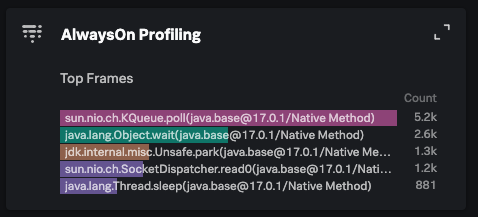
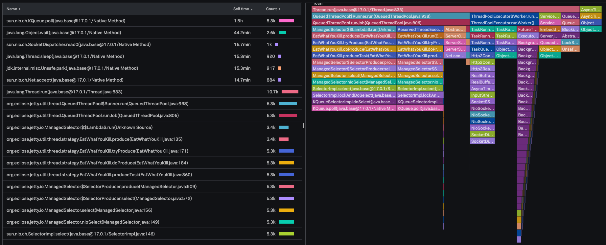
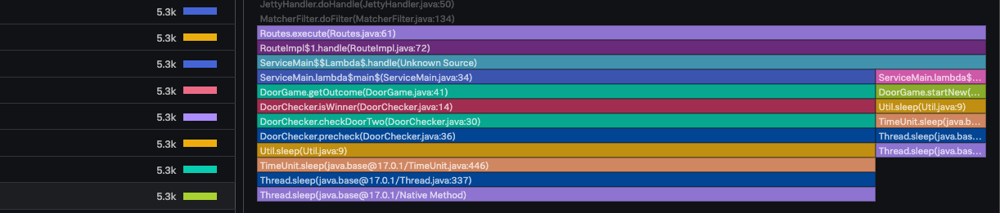
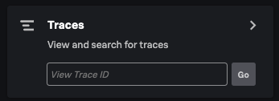
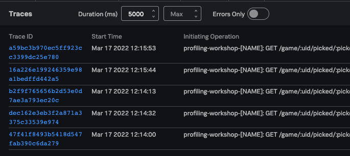
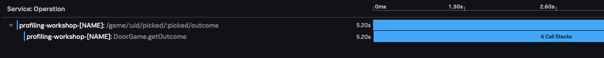
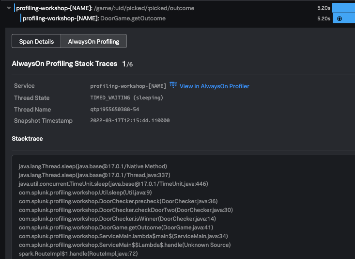

# Instrument and Investigate

### **1. Enable Profiling**
<details>
  <summary>Talk Track Preface</summary>
We have verified that our java application is sending traces to our otel collector in Docker, which is forwarding those traces to the o11y cloud. Now, let's enable profiling. There are only two changes that we need to make to the launch command. The first one is a bool switch that turns on the profiler, and the second sets the sampling interval in milliseconds. 
</details>

To relaunch the application with profiling, lets first stop the sample app by navigating to its terminal and hitting `control + c`. Then, we can add the two new lines to the command:

=== "New Lines"
	```text
	-Dsplunk.profiler.enabled=true 				<-- Bool switch, false by default
    -Dsplunk.profiler.call.stack.interval=1000 	<-- Sampling rate in milliseconds
	```
=== "Launch Command"
	```text
	java -javaagent:splunk-otel-javaagent-all.jar \
	    -Dsplunk.profiler.enabled=true \			
	    -Dsplunk.profiler.call.stack.interval=1000 \
	    -Dotel.resource.attributes=deployment.environment=workshop \
	    -Dotel.service.name=profiling-workshop-[NAME] \
	    -jar build/libs/profiling-workshop-all.jar
	```

---

### **2. Verify Profiler Operation**
<details>
  <summary>Talk Track Preface</summary>
To confirm that our profiler is running, we should see two things. The first, is a line output that indicates a .jfr file is being detected every sixteen seconds or so. The second, are logs being sent to the OpenTelemetry Collector in addition to spans once we play a few more rounds of the game.
</details>

Once we launch the application script, we should see a line indicating that a new `jfr` file has been detected printed as part of the launch sequence: 

```text
[Thread-1] INFO org.eclipse.jetty.server.session - DefaultSession...
[Thread-1] INFO org.eclipse.jetty.server.session - No SessionScav...
[Thread-1] INFO org.eclipse.jetty.server.session - node0 Scavengi...
[Thread-1] INFO org.eclipse.jetty.server.AbstractConnector - Star...
[Thread-1] INFO org.eclipse.jetty.server.Server - Started @2063ms
[otel.javaagent 2022-03-17 11:29:13:305 -0400] [JFR Recording Sequencer] INFO com.splunk.opentelemetry.profiler.JfrPathHandler - New jfr file detected: ...  <-- THIS ONE
```

Navigate to [http://localhost:9090](http://localhost:9090) and play a few more rounds of the door game. Then, navigate to `tracing-examples/profiling/workshop` and check your docker logs. There should be both spans **and** logs present. 

```text
2022-03-17T15:38:13.412Z	INFO	loggingexporter/logging_exporter.go:71	LogsExporter	{"#logs": 250}
2022-03-17T15:38:23.461Z	INFO	loggingexporter/logging_exporter.go:71	LogsExporter	{"#logs": 95}
2022-03-17T15:38:33.510Z	INFO	loggingexporter/logging_exporter.go:71	LogsExporter	{"#logs": 250}
2022-03-17T15:38:43.375Z	INFO	loggingexporter/logging_exporter.go:71	LogsExporter	{"#logs": 90}
2022-03-17T15:38:53.434Z	INFO	loggingexporter/logging_exporter.go:71	LogsExporter	{"#logs": 250}
2022-03-17T15:39:03.523Z	INFO	loggingexporter/logging_exporter.go:71	LogsExporter	{"#logs": 73}
2022-03-17T15:39:12.572Z	INFO	loggingexporter/logging_exporter.go:41	TracesExporter	{"#spans": 4}
2022-03-17T15:39:13.577Z	INFO	loggingexporter/logging_exporter.go:71	LogsExporter	{"#logs": 250}
2022-03-17T15:39:23.438Z	INFO	loggingexporter/logging_exporter.go:71	LogsExporter	{"#logs": 72}
2022-03-17T15:39:33.495Z	INFO	loggingexporter/logging_exporter.go:71	LogsExporter	{"#logs": 250}
2022-03-17T15:39:43.549Z	INFO	loggingexporter/logging_exporter.go:71	LogsExporter	{"#logs": 95}
2022-03-17T15:39:47.567Z	INFO	loggingexporter/logging_exporter.go:41	TracesExporter	{"#spans": 10}
2022-03-17T15:39:52.588Z	INFO	loggingexporter/logging_exporter.go:41	TracesExporter	{"#spans": 2}
2022-03-17T15:39:53.593Z	INFO	loggingexporter/logging_exporter.go:71	LogsExporter	{"#logs": 250}
```

---

### **3. Icicle Graph Visualization**
<details>
  <summary>Talk Track Preface</summary>
Now that we have our application instrumented, we will be able to see that data visualized in the Splunk Observability Cloud. Splunk has two out-of-the-box approaches to troubleshooting through profiling - a top down approach, and a bottom up approach. Let's start with the top down approach - the Icicle graph
</details>

From the APM homepage, find the right hand sidebar, and click on the AlwaysOn Profiling card.

{style="height:35%;width:35%"} 

<details>
  <summary>Talk Track</summary>
In order to help developers and SREs get a higher level, intuitive visualization of which call stacks are taking the longest to run, and potentially causing latency and other issues in the system, we generate an icicle graph using the application's log data. We can navigate in the graph by clicking on whichever stack we want to zoom into, and search for specific terms as well. 
</details>

Click on any stack in the icicle graph to zoom in. Let's choose the long and thin icile on the left hand side. Once we do, note that the call stacks near the tip of the icicle directly reference the door game we are running. 

{style="height:70%;width:70%"} 
{style="height:70%;width:70%"}

Recall the latency we saw in Door 3 versus Door 1 and Door 2. In the icicle graph, we can already begin investigating the sleep methods running after the `DoorChecker.precheck()` function. For the sake of demonstration, however, let's see the bottom up approach first. 

---

### ** 4. Traces Sampling **

From the APM homepage, find the right hand sidebar, and click on the Traces card

{style="height:35%;width:35%"} 

Profiling enhances the traces that are being sent by sampling its call stacks. We want to find a trace that runs long enough to increase the chances of it having a sampled call stack - in this demo, it should show up as a trace lasting for more than five seconds. To filter for such traces, we can specify in the filter that we only want to see traces that last for five seconds than longer. 

{style="height:50%;width:50%"} 

Clicking in on any of the traces, we should be met with this screen. If there are no call stacks sampled, pick another trace. It is perfectly fine if there are less than six call stacks

{style="height:80%;width:80%"} 

We should see that the innermost span `DoorGame.getOutcome` is responsible for the slowdown. We can click into this span to gain more detail, and view our sampled call stacks

In our case, we can quickly see that DoorChecker is called as we are getting the outcome of the game. ut, that issues a precheck function that triggers a long series of sleep functions. We can view the other call stacks to verify that this is indeed the case for all call stacks. Once we know that every sample is held up in the same sleep call, we have a good lead for where we should start looking at our code. 

{style="height:50%;width:50%"} 


