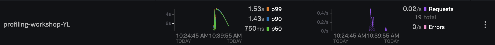

# Setup and Basic GDI 
<sup>**Attribution:**
	Full credits to Jason Plumb for building the apps, scripts, and resources used here. This workshop is fully based on his [very detailed documentation](https://github.com/signalfx/tracing-examples/tree/main/profiling). </sup>

### 1. **Clone repository**
<details>
  <summary>Talk Track Preface</summary>
The AlwaysOn Profiling tool is something that allows developers to get code level fidelity on the origin of their errors. It is an enrichment of our APM process, as for many of our users, being able to isolate the issue down to a couple of files on a specific application is not quite enough, if the files they have to search through contain, for example, thousands of lines of code. Our Profiling solution is a great response to such an issue, especially towards those we are personally responsible for resolving code-related issues that appear in their pipeline. So, the objective of our workshop today is to build, instrument, and run a java application and set up a collector on your local machine so that you are ready to show this capability when the need arises. I’ve posted the workshop instructions in the chat so feel free to follow along now, or in your own time later. The first thing we need to do is set up where our workshop is going to take place. To do this, we clone tracing-examples.git repository, and cd into the tracing-examples/profiling/workshop.
</details>

Navigate to your user directory and clone the repository
=== "Script"
	```text
	cd /User/NAME
	git clone https://github.com/signalfx/tracing-examples.git
	```
=== "Expected Output"
	```text
	Cloning into 'tracing-examples'...
	remote: Enumerating objects: 2961, done.
	remote: Counting objects: 100% (1009/1009), done.
	remote: Compressing objects: 100% (620/620), done.
	remote: Total 2961 (delta 409), reused 767 (delta 247), pack-reused 1952
	Receiving objects: 100% (2961/2961), 4.68 MiB | 12.79 MiB/s, done.
	Resolving deltas: 100% (1069/1069), done.
	```

Then, navigate to the workshop directory 
```text
cd tracing-examples/profiling/workshop
```

---

### 2. **Build Java application**
<details>
  <summary>Talk Track Preface</summary>
The first thing we need to do here is run an initial build of our demo java application, so we run ./gradlew shadowJar and verify that the output is successful. 
</details>


From the workshop directory, build the java application
=== "Script"
	```text
	./gradlew shadowJar
	```
=== "Expected Output"
	```text
	Starting a Gradle Daemon (subsequent builds will be faster)
	BUILD SUCCESSFUL in 5s
	3 actionable tasks: 3 up-to-date
	```

!!! info
	If there are any errors, have the participants re-install java using `sdk install java`
	 If the issue is about gradle dependencies, run the following command:
	 ```text
	 rm -rf /Users/[NAME]/.gradle/wrapper/dists/* 
	 ```

---
### 3. **Deploy Otel Collector**
<details>
  <summary>Talk Track Preface</summary>
So now that we have our Java application built on our local machine, we need to set up the next component, which is deploying the Otel Collector within a docker container. The application will be instrumented to send logs to the collector, and the collector will be configured with an access token to forward those logs to the observability cloud. 

The command to deploy the otel collector in a docker container is already provided, just make sure that you are in the workshop directory, as it is what the script expects. 
</details>

Make sure Docker is open, and run the following command in the workshop directory
=== "Script"
	```text
	docker run -d --rm --name collector \
    -v "$(pwd)/etc/collector.yaml":/etc/otel/config.yaml \
    -p 4317:4317 \
    -e SPLUNK_TOKEN=pMIUgbzKE8sqIrT2cdq_8g \
    -e SPLUNK_REALM=us0 \
    otel/opentelemetry-collector-contrib:0.36.0 
	```
=== "Expected Output"
	```text
	You should expect to see a long hex number (GUID)
	```

To verify that our specific docker container has been created, we can run the following: 
=== "Script"
	```text
	docker ps --filter name=collector
	```
=== "Expected Output Example"
	```text
	CONTAINER ID   IMAGE                                         COMMAND                  CREATED      STATUS      PORTS                                     NAMES
	5c07e39af6b6   otel/opentelemetry-collector-contrib:0.36.0   "/otelcontribcol --c…"   2 days ago   Up 2 days   0.0.0.0:4317->4317/tcp, 55679-55680/tcp   collector
	```

!!! info
	- The docker container script is dependent on the workshop token *pMIUgbzKE8sqIrT2cdq_8g*. If things suddenly stop working, go [here](https://app.signalfx.com/#/organization/current?selectedKeyValue=sf_section:accesstokens) to grab another one. 
	- Some interactive shells (i.e fish) don't interact well with the `$(pwd)` notation. If errors occur, run the above script without the interactive shell 

---

### 4. **Basic Instrumentation**
<details>
  <summary>Talk Track Preface</summary>
We now have all our components independently set up. On one hand, we have a the Open Telemetry collector deployed in a docker container, which is connected to our Splunk Cloud with the token used above. Independenly on the other hand, we have our Java application. Our goal here is to have the application connect to the Open Telemetry collector by first sending basic spans. We do this by running the application with the Splunk distribution of the Open Telemetry Java instrumentation 
</details>

First, run this curl command in the workshop directory
```text
curl -L -o splunk-otel-javaagent-all.jar https://github.com/signalfx/splunk-otel-java/releases/latest/download/splunk-otel-javaagent-all.jar
```

Then, we can run the application with default settings to verify that spans are being ingested. Be sure to change the `Dotel.service.name` variable to contain your name or initials, such that it is unique

```text
java -javaagent:splunk-otel-javaagent-all.jar \
    -Dotel.resource.attributes=deployment.environment=workshop \
    -Dotel.service.name=profiling-workshop-<xxx> \
    -jar build/libs/profiling-workshop-all.jar
```

---

### 5. **Verify**
To verify the application is working, go to [http://localhost:9090](http://localhost:9090) and you should see a UI for The Door Game. Play a few rounds to generate some data to send to the Observability cloud. 

Note that if you select and stay with Door 3, there is significantly more latency than if you select and stay with Door 1. 

Now that we have played a few rounds, the application should have started sending spans to the OpenTelementry Collector. To verify that, we can run the following within the `workshop` directory: 
=== "Script"
	```text
	docker logs collector
	```
=== "Expected Output Example"
	```text
	2022-03-17T14:34:29.541Z	INFO	loggingexporter/logging_exporter.go:41	TracesExporter	{"#spans": 2}
	2022-03-17T14:34:34.554Z	INFO	loggingexporter/logging_exporter.go:41	TracesExporter	{"#spans": 8}
	2022-03-17T14:34:49.474Z	INFO	loggingexporter/logging_exporter.go:41	TracesExporter	{"#spans": 8}
	2022-03-17T14:34:59.535Z	INFO	loggingexporter/logging_exporter.go:41	TracesExporter	{"#spans": 4}
	2022-03-17T14:35:04.548Z	INFO	loggingexporter/logging_exporter.go:41	TracesExporter	{"#spans": 2}
	2022-03-17T14:35:09.583Z	INFO	loggingexporter/logging_exporter.go:41	TracesExporter	{"#spans": 2}
	2022-03-17T14:35:14.618Z	INFO	loggingexporter/logging_exporter.go:41	TracesExporter	{"#spans": 4}
	2022-03-17T14:35:24.489Z	INFO	loggingexporter/logging_exporter.go:41	TracesExporter	{"#spans": 4}
	2022-03-17T14:35:29.515Z	INFO	loggingexporter/logging_exporter.go:41	TracesExporter	{"#spans": 2}
	```

<!-- {style="height:35%;width:35%"} 
	https://github.com/mkdocs/mkdocs/issues/1678
 -->

Now, to verify that that our results show up in the observability UI, we can navigate to [our observability cloud](https://app.signalfx.com/#/apm?endTime=Now&environments=workshop&filter=&job=full&startTime=-15m). We should see something akin to this: 

{style="height:80%;width:80%"} 

!!! info
	The APM hyperlink is connected to the token used above in the Otel docker deployment. If you are using a new token, make sure to navigate to its environment, rather than use the environment linked above


